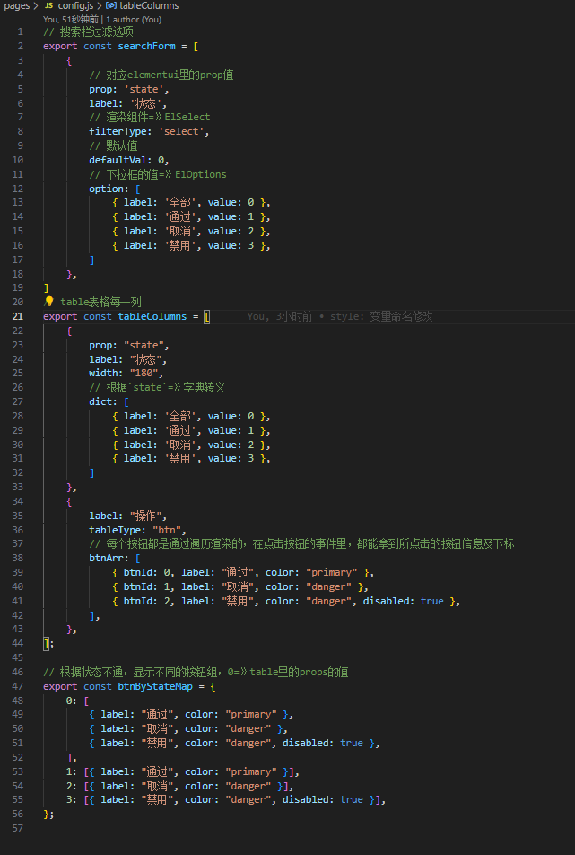

1. 先说说背景
   
   - 后台大多数都是table表单，重复性的工作，根本提不起精神，就差睡着了
   - 之前也封装了一个table组件，用的是template写法（[https://juejin.cn/post/7260783336217329724](https://)），但是当需求越复杂，用template就不灵活
2. 上预览图，第一版就是目前看到的这些功能，要是有空，后续继续完善


3. 目录机构
   ├── src/
   │   ├── components/
   │   │   ├── mTable.jsx         # 合并Search，table,paginate
   │   │   ├── Search.jsx         # 表单操作栏
   │   │   ├── paginate.jsx       # 分页
   │   │   └── table.jsx          # table
   │   ├── pages/
   │   │   ├── config.js          # 数据配置项
   │   │   ├── index.jsx          # 使用jsx引入table组件
   │   │   └── index.vue          # 使用template引入table组件
   │   ├── mock.jsx               # mock数据
   │   └── App.jsx
   └──
4. 重点看下`config.js`文件配置

5. Api
    1. searchForm
    ```js
    `事件`
    | 事件名   | 说明 | 形参 |
    |--------|------|------|
    | `onFormEvent`   | searchForm按钮事件   | e: {search, btnInfo}   |
    | `onResetSearch`   | 重置搜索   | resetForm |
    `属性`
    | `filterForm`   | filterForm   |  |
    ```

    2. table
    ```js
    `事件`
    | 事件名   | 说明 | 形参 |
    |--------|------|------|
    | `onTableBtnEvent`   | 操作栏按钮事件   | e: {btnIdx, colIdx, $index, row}   |
    | `onTableInput`   | input事件   | val， row |
    | `onSwitchChange`   | switch事件   | bln, row |
    | `onSelectionChange`   | table多选事件   | row |
    `属性`
    | `tableData`   | table源数据   |  |
    | `columns`   | tablecolumns   |  |
    | `tableMultiple`   | 多选   |  |
    | `btnByStateMapAt`   |  tableColumns属性key  |  |
    | `btnByStateMapAt`   | 根据状态tableColumns属性key，显示不同的按钮   |  |
    ```

    3. 分页
    ```js
    `事件`
    | 事件名   | 说明 | 形参 |
    |--------|------|------|
    | `onPageSizeEvent`   | 页容量事件   | pageSize   |
    | `onPageEvent`   | 当前页事件   | page |
    `属性`
    | `pageInfo`   | 分页信息   |  |
    ```
