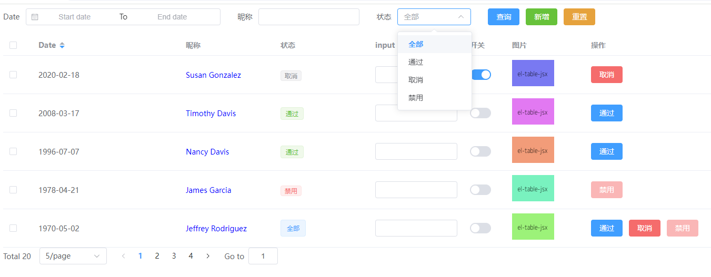

## 文档
<a href="https://dandan228.github.io/vue3-eltable-jsx-docs/">文档地址</a>

## 为什么用*el-table-jsx*

> 当后台模块都需重复开发时，利用基于 Vue 3 和 Element Plus 的`JSX`封装组件，您只需专注于配置，无需处理内部逻辑。无论是表格`table`、表单`form`，还是对话框`dialog`等组件，统一管理和快速开发都变得异常简便！

**<span style="color:blue;">1. 先说说背景</span>**

- 后台大多数都是 table 表单，重复性的工作，根本提不起精神，就差睡着了
- 之前也封装了一个 table 组件，用的是 template 写法（[https://juejin.cn/post/7260783336217329724](https://)），但是当需求越复杂，用 template 就不灵活

**<span style="color:blue;">2. 上预览图，持续更新中</span>**


**<span style="color:blue;">3. 目录机构</span>**

```
 ├── src/
 │   ├── dist/
 │   │   ├── components/
 │   │   │   ├── MTable.jsx       # 合并所有组件
 │   │   │   ├── Form.jsx       # form表单
 │   │   │   ├── Paginate.jsx     # 分页
 │   │   │   ├── Table.jsx        # table
 │   │   │   ├── Dialog.jsx       # Dialog
 │   │   │   ├── index.js         # 导出组件
 │   ├── pages/
 │   │   ├── config.js            # 数据配置项
 │   │   ├── index.jsx            # 使用jsx引入table组件
 │   │   └── index.vue            # 使用template引入table组件
 │   ├── mock.jsx                 # mock数据
 │   └── App.jsx

```

**<span style="color:blue;">4. 重点看下`config.js`文件配置</span>**


**<span style="color:blue;">5. 使用方法</span>**

1. 安装依赖

```js
npm i el-table-jsx @vitejs/plugin-vue-jsx
```

1.1 vite.config.js 引入插件

```js
import { defineConfig } from "vite";
import vue from "@vitejs/plugin-vue";
import vueJsx from "@vitejs/plugin-vue-jsx";

export default defineConfig({
  plugins: [vue(), vueJsx()],
});
```

2. 引入组件（具体用法，可以看 src/pages/index.jsx, 或者 src/pages/index.vue）

```js
// template用法
<template>
  <MTable :columns="columns" :tableData="tableData" />
</template>
<script setup>
import { MTable } from 'el-table-jsx'

const columns = [
  {
    prop: "date",
    label: "Date",
    width: "280",
    sortable: true,
  },
  {
    prop: "name",
    label: "昵称",
    width: "180",
    color: "blue",
  },
]

const tableData = [
  {
    data: '2020-09-01',
    name: '张三'
  },
  {
    data: '2020-09-02',
    name: '李四'
  }
]
</script>
```

```js
// jsx用法
import { defineComponent, reactive } from "vue";
import { MTable } from "el-table-jsx";

const columns = [
  {
    prop: "date",
    label: "Date",
    width: "280",
    sortable: true,
  },
  {
    prop: "name",
    label: "昵称",
    width: "180",
    color: "blue",
  },
];

const tableData = [
  {
    date: "2020-09-01",
    name: "张三",
  },
  {
    date: "2020-09-02",
    name: "李四",
  },
];

defineComponent({
  name: "TableComponent",
  setup() {
    const state = reactive({
      columns,
      tableData,
    });

    return () => <MTable columns={state.columns} tableData={state.tableData} />;
  },
});
```

