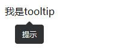

## 基础使用



```js
import { defineComponent } from "vue";
import { Tooltip } from "el-table-jsx";

export default defineComponent({
  setup(props, { emit }) {
    return () => <Tooltip tooltipInfo={{content: '提示'}}>我是tooltip</Tooltip>;
  },
});


```

## 属性

| 属性名      | 说明             | 默认值 | 类型   |
| ----------- | ---------------- | ------ | ------ |
| tooltipInfo | tooltipInfo 配置 | {}     | object |