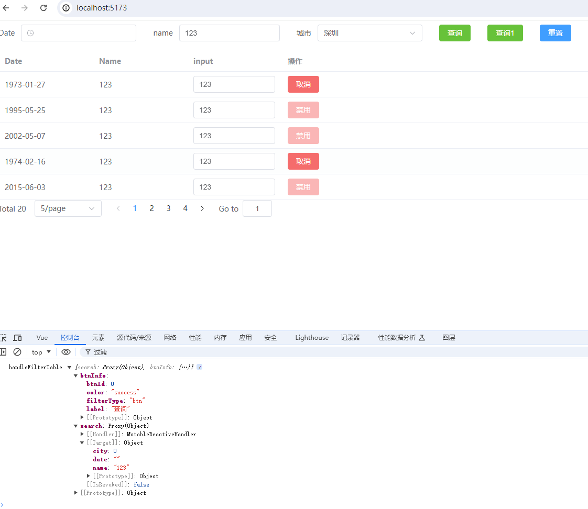
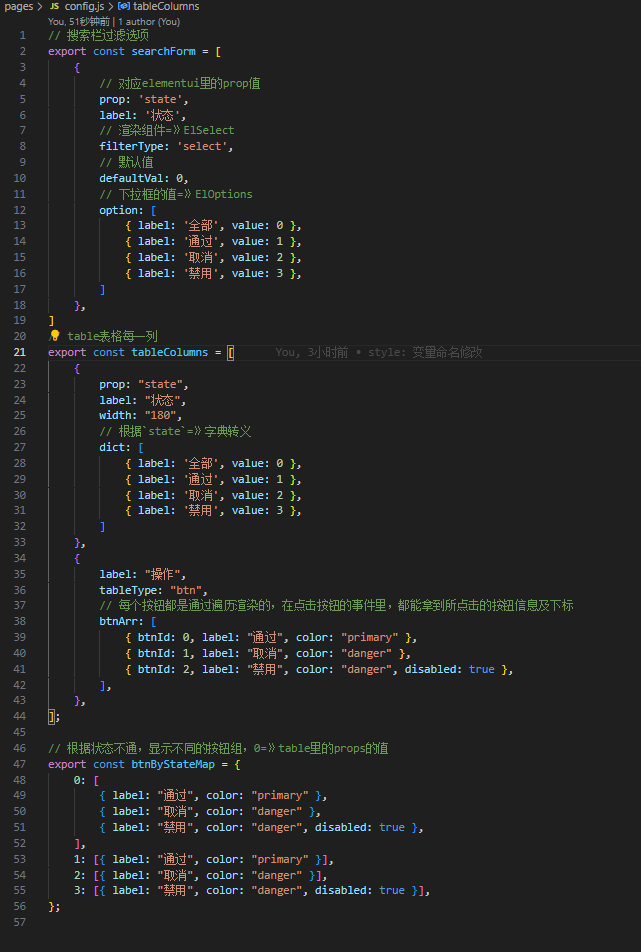
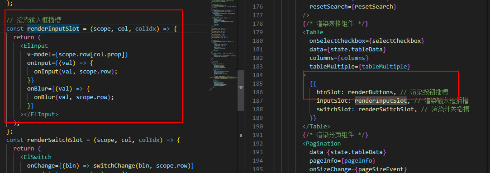

#### 为什么用*el-table-jsx*
>当后台模块都需重复开发时，利用基于Vue 3和Element Plus的`JSX`封装组件，您只需专注于配置，无需处理内部逻辑。无论是表格（table）、表单（form），还是对话框（dialog），统一管理和快速开发都变得异常简便！

**<span style="color:blue;">1. 先说说背景</span>**
   
   - 后台大多数都是table表单，重复性的工作，根本提不起精神，就差睡着了
   - 之前也封装了一个table组件，用的是template写法（[https://juejin.cn/post/7260783336217329724](https://)），但是当需求越复杂，用template就不灵活

**<span style="color:blue;">2. 上预览图，我将会持续更新</span>**


**<span style="color:blue;">3. 目录机构</span>**
  ```
   ├── src/
   │   ├── dist/
   │   │   ├── components/          
   │   │   │   ├── MTable.jsx       # 合并所有组件
   │   │   │   ├── Form.jsx       # form表单
   │   │   │   ├── Paginate.jsx     # 分页
   │   │   │   ├── Table.jsx        # table
   │   │   │   ├── Dialog.jsx       # Dialog
   │   │   │   ├── index.js         # 导出组件
   │   ├── pages/
   │   │   ├── config.js            # 数据配置项
   │   │   ├── index.jsx            # 使用jsx引入table组件
   │   │   └── index.vue            # 使用template引入table组件
   │   ├── mock.jsx                 # mock数据
   │   └── App.jsx

  ```
  **<span style="color:blue;">4. 重点看下`config.js`文件配置</span>**


**<span style="color:blue;">5. 使用方法</span>**
1. 安装依赖
```js
npm i el-table-jsx @vitejs/plugin-vue-jsx
```

1.1 vite.config.js引入插件

```html
import { defineConfig } from 'vite'
import vue from '@vitejs/plugin-vue'
import vueJsx from '@vitejs/plugin-vue-jsx'

export default defineConfig({
  plugins: [vue(), vueJsx()],
})

```
2. 引入组件（具体用法，可以看src/pages/index.jsx, 或者src/pages/index.vue）
```js
// 这是template用法
<template>
  <MTable
    :columns="columns"
    :data="state.tableData"
    :pageInfo="{
      total: 0,
      page: 1,
      pageSize: 10,
    }"
  />
</template>

// MTable= Form + Table + Pagination + Dialog
import { MTable, Form, Table, Pagination, Dialog } from "el-table-jsx";


// 这是jsx用法
return () => (
      <MTable
        columns={columns}
        formColumns={formColumns}
        tableData={state.tableData}
        pageInfo={state.pageInfo}
        btnByStateMap={btnByStateMap}
        btnByStateMapAt={"state"}
        tableMultiple
        onFormEvent={formEvent}
        onTableBtnEvent={tableBtnEvent}
        onPageSizeEvent={pageSizeEvent}
        onPageEvent={pageEvent}
        onResetSearch={resetSearch}
        onTableInput={tableInput}
        onTableBlur={tableBlur}
        onSelectCheckbox={selectCheckbox}
        onSwitchChange={switchChange}
      />
    );
```
3. 当单独使用`table`组件，table里需要使用input，switch,按钮时，需要单独引入插槽，如下



**<span style="color:blue;">6. Api</span>**
>切记：当用template用法时，事件前缀不需要加on

 <span style="color:red;">Form</span>

`事件`
| 事件名   | 说明 | 出参 |
|--------|------|------|
| onFormEvent   | searchForm按钮事件   | e: {form, btnInfo}   |
| onResetSearch   | 重置搜索   | resetForm |
| onRadioChange   | 单选框   | e |
| resetModelForm   | 使用 ref 来调用子组件的 resetModelForm 方法`FormRef.value.resetModelForm()`，以达到清空数据的效果   |  |

`属性`
| 属性名   | 说明 | 出参 |
|--------|------|------|
| formColumns   | formColumns   |  |
| inline   | 行内表单模式   |  |
| labelWidth   | 标签的长度，例如 '50px'。 作为 Form 直接子元素的 form-item 会继承该值。 可以使用 auto   |  |
| labelPosition   | 表单域标签的位置， 当设置为 left 或 right 时，则也需要设置 label-width 属性   |  |

<span style="color:red;">table</span>

`事件`
| 事件名   | 说明 | 出参 |
|--------|------|------|
| onTableBtnEvent   | 操作栏按钮事件   | e: {btnIdx, colIdx, $index, row}   |
| onTableInput   | input事件   | val， row |
| onSwitchChange   | switch事件   | bln, row |
| onSelectionChange   | table多选事件   | row |
| onSortChange   | table表头排序事件   | sort |
| rowItemEvent   | table里的a标签   | row |
| onRadioChange   | 单选框   | e |

`属性`
| 属性名   | 说明 | 出参 |
|--------|------|------|
| tableData   | table源数据   |  |
| columns   | columns   |  |
| tableMultiple   | 多选   |  |
| btnByStateMapAt   |  columns属性key  |  |
| btnByStateMap   | 根据状态columns属性key，显示不同的按钮   |  |
| defaultSort   | 表头默认排序(是个对象)   |  |

<span style="color:red;">分页</span>

`事件`
| 事件名   | 说明 | 出参 |
|--------|------|------|
| onPageSizeEvent   | 页容量事件   | pageSize   |
| onPageEvent   | 当前页事件   | page |

`属性`

| 属性名   | 说明 | 出参 |
|--------|------|------|
| pageInfo   | 分页信息   |  |


<span style="color:red;">dialog</span>


`属性`

| 属性名   | 说明 | 出参 |
|--------|------|------|
| dialogVisible   | 是否显示对话框   |  |
| title   | title   |  |
| width   | width   |  |